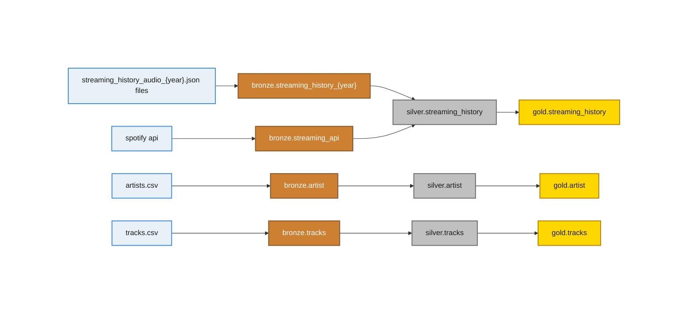

# Spotify-playlist-analysis

## Overview
Learning project for databricks and spark using spotify artist and track datsets from Kaggle and my own streaming history requested from spotify for plays from 2011-2026
- personal spotify streaming info requested through spotify, data runs from 2011-2026
- current and future streaming info pulled through spotify api (limited to 50 per request) on a job that runs every 1 hour
- artist info csv pulled from Kaggle

  
## Architecture

---

